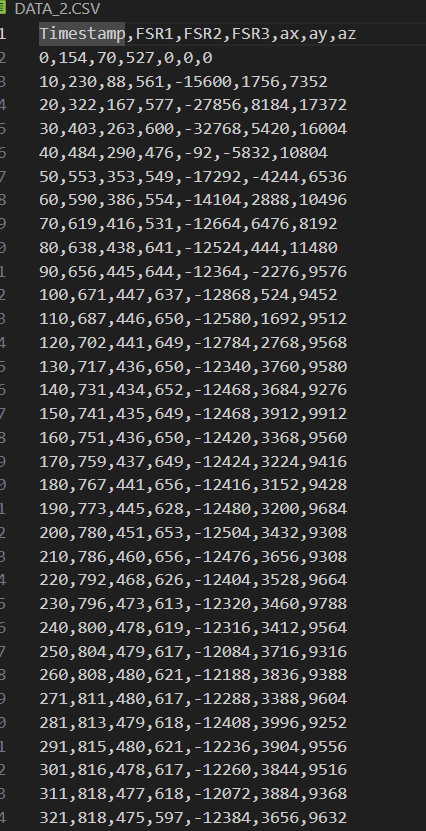

# Arduino-High-Data-Samples

## Task
Record a person's movement and gait cycle and analyze if it is normal or not.

## Purpose of This Circuit and Code
* The objective is to record high sample rate data using an Arduino microcontroller.
* Data should be recorded at 100 frames per second for 2 minutes.
* All sensor data should be saved in a `.csv` file.

## Components Used
* ***MPU-6050*** for capturing acceleration and gyroscopic movement.
* ***SD Card Module*** for saving data in a CSV file using Arduino.
* ***4 FSR Sensors*** for recording a person's movement.
* ***ATmega2560*** for reading and saving high sample rate data.

## Connections (ATmega2560 to Sensors)
* SD Card Module 5V to Arduino 5V
* SD Card Module GND to Arduino GND
* SD Card Module MISO to Arduino pin 50
* SD Card Module MOSI to Arduino pin 51
* SD Card Module CS to Arduino pin 10
* MPU-6050 SDA & SCL to Arduino SDA & SCL
* MPU-6050 VCC & GND to Arduino 5V & GND
* FSR sensor output to Arduino A0 to A3

## Challenges and Solutions
The most difficult part was recording ***high sample rate data***. Recording data from the FSR sensors and saving it at a high sample rate to a CSV file was manageable. However, problems arose with the ***MPU-6050***. Initially, I used the Adafruit library to read the data and convert it to human-readable form. However, this process took too much time, causing issues with saving the data correctly to the CSV file, resulting in saving `?,?,?` instead of real data.

To solve this problem, I removed the Adafruit library and used the `Wire.h` library to address the MPU-6050 registers directly and retrieve raw data. This approach allowed me to efficiently save the data to the CSV file and complete the project successfully.

## Result Data

